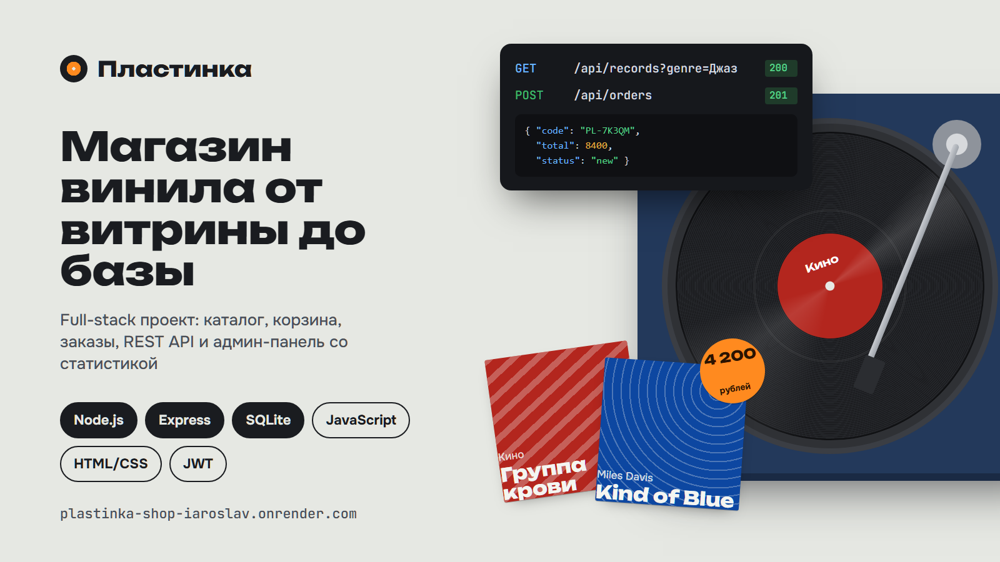

# Пластинка — магазин виниловых пластинок



Full-stack проект для портфолио: витрина, REST API, база данных и админ-панель.
Без фронтенд-фреймворков и ORM — чтобы было видно, как всё устроено изнутри.

**Живая версия:** https://plastinka-shop-iaroslav.onrender.com — админка: https://plastinka-shop-iaroslav.onrender.com/admin (`admin` / `admin123`), API: https://plastinka-shop-iaroslav.onrender.com/docs

> Хостинг бесплатный: если сайт долго не открывали, первый запуск занимает до минуты. База сбрасывается к демо-данным при перезапуске.

## Что умеет

**Витрина** (`/`)
- каталог с фильтром по жанрам, поиском, сортировкой и фильтром наличия — всё фильтруется на сервере SQL-запросом;
- карточка пластинки со свежими остатками из базы;
- корзина (localStorage) и оформление заказа с серверной валидацией — ошибки подсвечиваются у нужных полей;
- отслеживание заказа по номеру;
- панель **API** в правом нижнем углу: каждый запрос страницы к серверу, статус, время ответа сервера и сам JSON.

**Админка** (`/admin`, демо-доступ `admin` / `admin123`)
- обзор: выручка, средний чек, график выручки за 14 дней (SVG без библиотек), лидеры продаж, остатки;
- заказы: фильтр по статусу, смена статуса, отмена с возвратом пластинок на склад;
- каталог: добавление, редактирование, удаление;
- журнал сервера: последние запросы к API в реальном времени.

**Документация API** (`/docs`) — список эндпоинтов, открытые GET-запросы можно выполнить прямо на странице.

## Стек

| Слой | Технологии |
|---|---|
| Фронтенд | HTML, CSS (custom properties, grid), vanilla JS (ES-модули), `<dialog>` |
| Бэкенд | Node.js 22+, Express 4 |
| База | SQLite через встроенный `node:sqlite` |
| Безопасность | scrypt-хеши паролей, JWT (HS256) на `crypto`, rate limit на вход, параметризованные запросы, экранирование вывода |

## Интересные места в коде

- `server/routes/public.js` — оформление заказа в транзакции: цены берутся из БД, остаток списывается атомарно `UPDATE … WHERE stock >= ?`, при нехватке — 409 и откат.
- `server/routes/admin.js` — статистика: агрегаты, рекурсивный CTE для дней без заказов.
- `server/auth.js` — JWT и хеширование паролей без сторонних библиотек.
- `server/validate.js` — декларативная валидация с ошибками по полям.
- `public/js/api.js` — обёртка над fetch и API-консоль.

## Запуск

```bash
npm install
npm start
```

Откройте http://localhost:3000. База `data/shop.db` создаётся при первом запуске с демо-каталогом и заказами за две недели.

- `npm run dev` — перезапуск сервера при изменении файлов
- `npm run reset-db` — удалить базу и начать с чистыми демо-данными

Переменные окружения (необязательно): `PORT`, `JWT_SECRET`, `ADMIN_USER`, `ADMIN_PASSWORD`, `DB_PATH`.

## Структура

```
server/
  index.js          Express: middleware, маршруты, обработчик ошибок
  db.js             схема, транзакции, демо-данные
  auth.js           пароли, JWT, rate limit
  validate.js       валидация входных данных
  logger.js         журнал запросов и X-Response-Time
  routes/public.js  каталог, заказы, отслеживание
  routes/admin.js   вход, статистика, управление заказами и каталогом
public/
  index.html        витрина
  admin/index.html  админ-панель
  docs.html         документация API
  css/, js/
```
